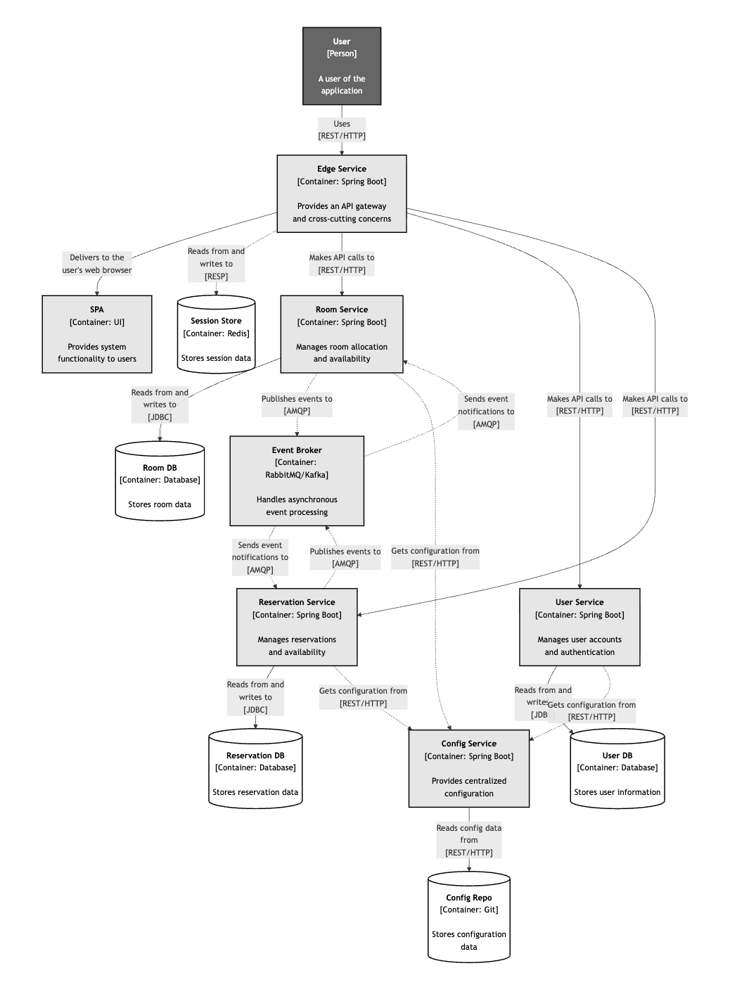

# Architecture Overview

## System Architecture

Our application follows a **microservices architecture** pattern, designed for scalability, resilience, and independent service deployment. The system is built using Spring Boot microservices with an event-driven communication model between critical services.

### Architecture Highlights

The architecture consists of three primary layers:

**1. API Gateway Layer**
- **Edge Service** acts as the single entry point for all client requests, handling authentication, routing, and cross-cutting concerns
- **Session Store (Redis)** manages distributed session data for fast, stateless operations

**2. Microservices Layer**
- **User Service**: Manages user accounts and authentication
- **Room Service**: Handles room allocation and availability
- **Reservation Service**: Orchestrates booking workflows and reservation management

**3. Infrastructure Layer**
- **Event Broker (RabbitMQ/Kafka)**: Enables asynchronous communication
- **Config Service**: Provides centralized configuration management
- Individual databases for each service ensuring data isolation

### Event-Driven Communication

A key architectural decision is the **asynchronous communication pattern** between the **Room Service** and **Reservation Service**. Instead of direct REST calls, these services communicate through an **Event Broker** using the publish-subscribe pattern.

**Why Async Communication?**

When a room booking occurs, multiple operations need to happen:
- Room availability must be updated
- Reservation records need to be created
- Potential conflicts must be resolved

By using asynchronous messaging:

**Loose Coupling**: Services remain independent; changes to one service don't directly impact the other

**Resilience**: If the Reservation Service is temporarily down, Room Service can still publish events. Messages are queued and processed when the service recovers

**Scalability**: Both services can scale independently based on load. High booking volume doesn't overwhelm room availability checks

**Event Sourcing**: All state changes are captured as events, providing a complete audit trail of bookings and availability changes

**Eventual Consistency**: The system maintains consistency across services without tight coupling, accepting that data synchronization happens asynchronously

**Event Flow Example:**
1. User requests a room booking through Reservation Service
2. Reservation Service publishes a "Reservation Created" event to the Event Broker
3. Room Service subscribes to this event and updates room availability
4. Room Service publishes a "Room Status Updated" event
5. Reservation Service receives the event and confirms the booking

This pattern ensures that both services maintain their own state while staying synchronized through event notifications, making the system more robust and maintainable.

### Technology Stack

- **Backend**: Spring Boot (Java)
- **Databases**: PostgreSQL
- **Cache**: Redis
- **Message Broker**: RabbitMQ 
- **API Gateway**: Spring Cloud Gateway
- **Configuration**: Spring Cloud Config
- **Frontend**: Angular (SPA)
